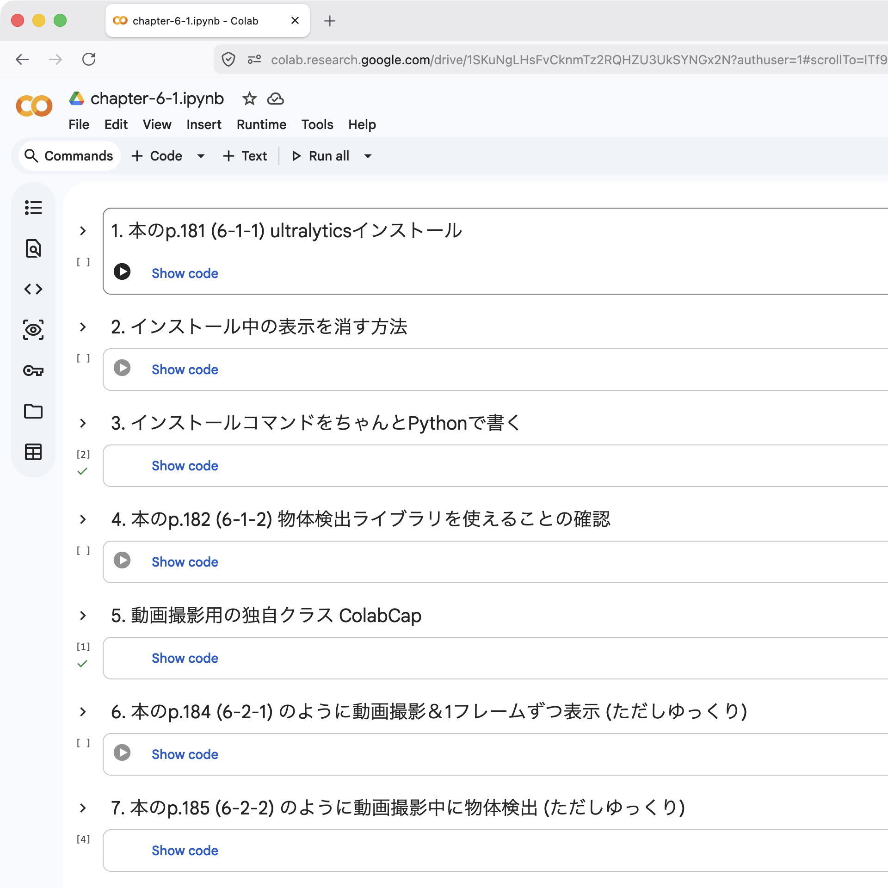

## Colabで本のChapter 6を動かす

### ソースコード（.ipynb&thinsp;形式)

- [<ins>その&thinsp;1</ins>](./colab-chapter-6-1.ipynb)：本の&thinsp;p.180〜187&thinsp;相当

  各セルを&thinsp;Colab&thinsp;に入力すると下図のようになるはず

  セル一つずつ、冒頭のコメントを参照して実行し、結果を確かめる

  

- To be continued...