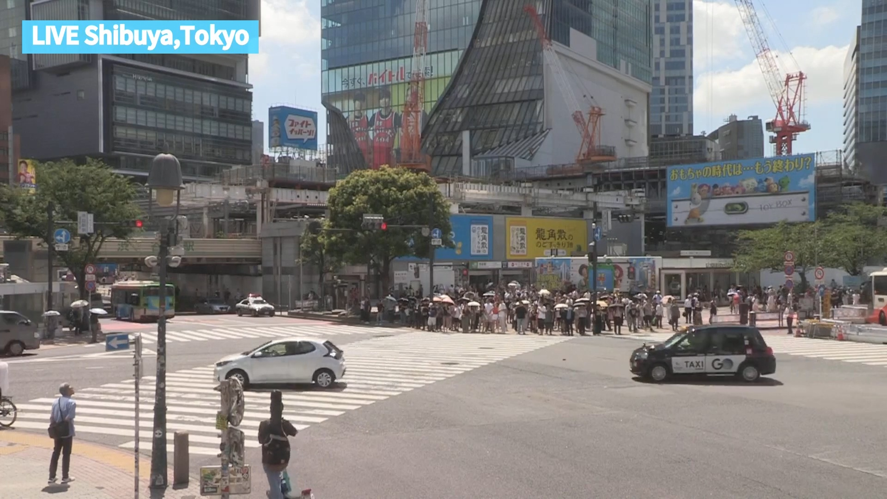
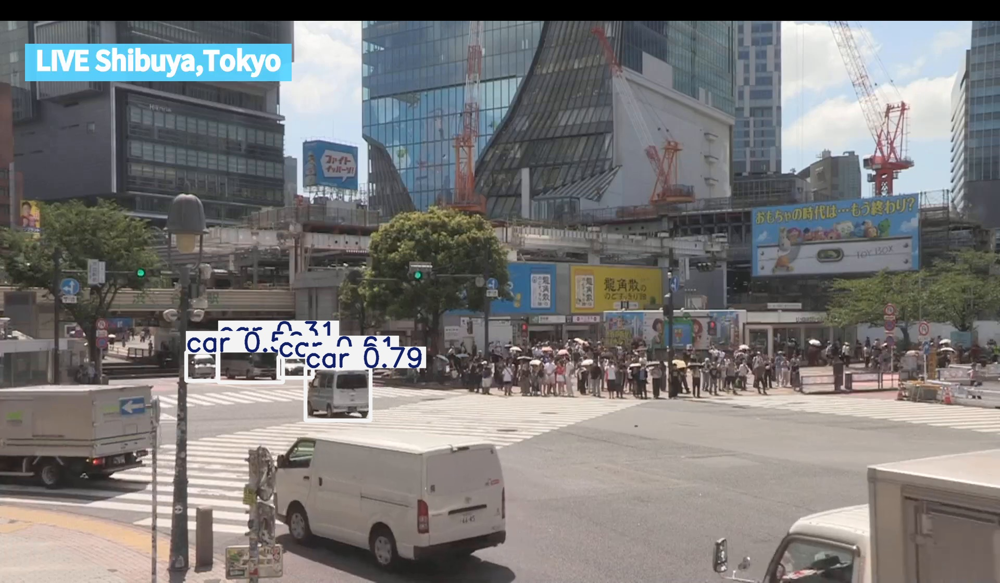
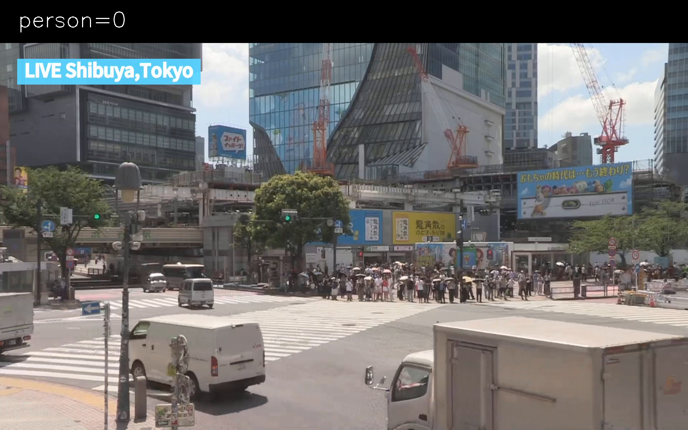
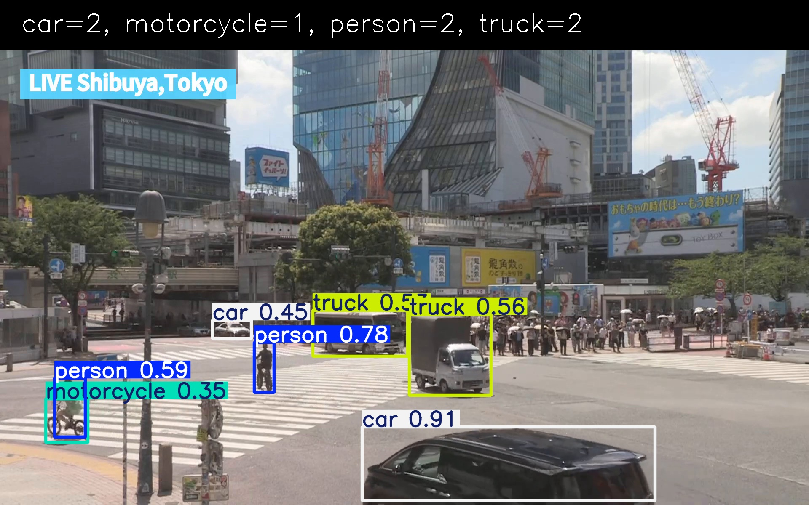

## 第16回 summary

### 概要
- 2026.7.10 at 13:30〜14:40 オンライン

- 参加者数 2（講師 1, 全体参加 1）

- 録画あり（120日間有効）

 

### 内容

- (1) 前回 [<ins>#15</ins>](../day-15/day-15-summary.md) の振り返り

  - 質問のあった `YOLO` モデル読み込み時のメッセージの差異：調査中

- (2) 今回の概要（Chapter 6 - 第&thinsp;2&thinsp;回）

  - 対象：本の&thinsp;p.188&thinsp;〜&thinsp;p.194&thinsp;（物体検出で人だけを対象にする, 人数を数える）

  - 本にはない＋α：既存動画から物体検出する, Colabの出力欄に検出結果を表示する

- (3) 参加者の画面を共有してもらい、一緒に作業

  - 作業用&thinsp;ipynb&thinsp;ファイルの読み込み

      - ipynb&thinsp;ファイル：[`../base/base_chapter_6_2.ipynb`](base/base_chapter_6_2.ipynb)

      - 直接開く&thinsp;URL：https://colab.research.google.com/github/ec22s/colab-ikinari-python/blob/main/base/base_chapter_6_2.ipynb

      - 自分の&thinsp;Google Drive&thinsp;にコピーして作業開始

  - `ipynb (1) (2)` 動画の準備（多くの人や車が登場する交差点の様子）, Colab&thinsp;内で再生し確認

    

  - `ipynb (3) (4)` 動画から1コマ1コマのフレームを抽出し表示

    - 前回同様、フレーム一つずつを物体検出ライブラリに渡す準備として

    - 画像表示は学習会独自の関数 [`colab_imshow`](../util/colab_imshow.py) を利用

  - `ipynb (5)〜(8)` 動画から物体検出, 人数をカウント

    - まず前回同様に対象を限定せずに

    - 次に本&thinsp;6-3-1&thinsp;と同様、人だけを対象に

    - 本&thinsp;p.186&thinsp;の検出対象クラス一覧を参考に、人以外に限定してみる

    - 人数をカウントする処理を追加し、出力欄に単純表示して確認

  - `ipynb (9)` 画像内に人数表示欄（上部の黒い帯）を追加

      - 本 6-4-2 (p.191) と同様、関数 `text_overwrite_to_image` を作成

        

    - 今回の動画の画面サイズが本の想定より大きく、人数表示欄の高さが本と同じ `40` だと狭い

    - 今回は以上で終了。次の `(10)` は次回までの自習課題とした

  - `ipynb (10)` カウントした人数を、画像の人数表示欄に出す

    - 本 6-4-3 (p.192〜193) と同様、関数 `text_overwrite_to_image` の引数に `text` `position` を加える

    - 表示欄の高さを増やしたら、文字サイズ・描画位置も合わせて調整する必要がある。その例は `ipynb` を参照。実行すると下記のようになる

      

  - 応用例 `ipynb (11)` 対象を絞らず、検出したクラスと数をまとめて画像に出す

    - 本にない＋α。追加で必要な処理は `ipynb` を参照。余裕があればの自習課題とした

      

- (3) クロージング

  - 質問：特になし

  - 次回内容：今回残った分も含め、Chapter 6&thinsp;の続きを行う

 

---
