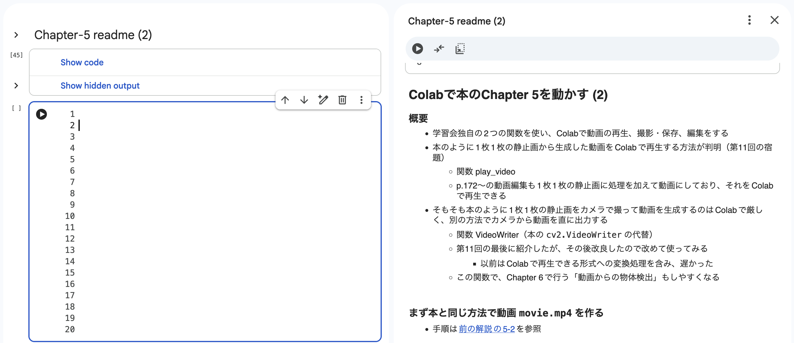
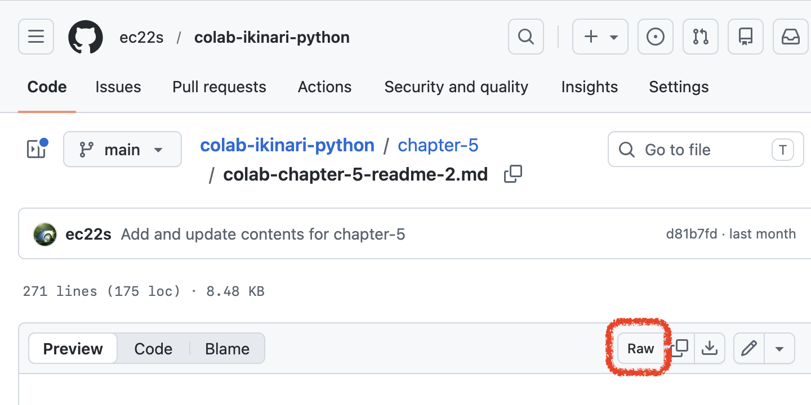
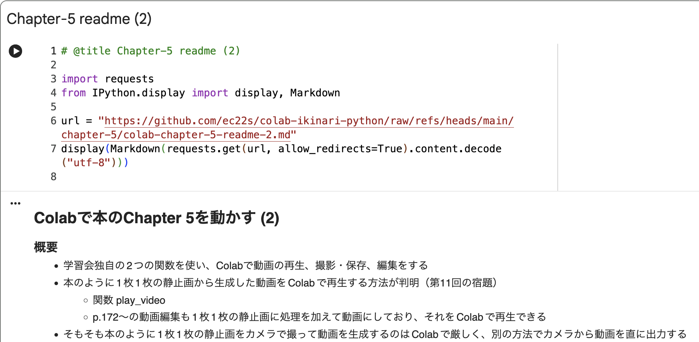
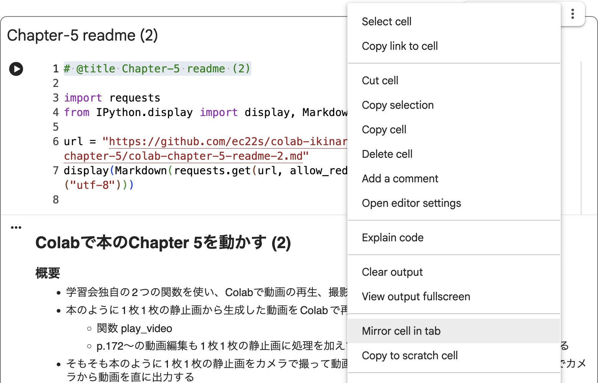

## コードの右側にMarkdownの解説を表示

<br>

　

- Colab&thinsp;の画面を&thinsp;2&thinsp;分割し「片側に&thinsp;Markdown&thinsp;の解説を表示、もう片方でコードを入力・実行」する例

- 解説&thinsp;↔&thinsp;コードの往復でブラウザの画面を切り替えずに済み、ノート&thinsp;PC&thinsp;など狭い画面でも作業し易い

- まず左側のセルに&thinsp;GitHub&thinsp;のパブリックリポジトリにある&thinsp;Markdown&thinsp;を読み込む

- 次に「タブのミラーセル」機能で&thinsp;Markdown&thinsp;を右側に複製し、左側は畳む

<br>

### 手順 1. MarkdownのRaw URLを調べる

- GitHub&thinsp;で&thinsp;Markdown&thinsp;を開き、右上の `Raw` ボタン上で右クリックし&thinsp;URL&thinsp;をコピー

  

- または、Markdown&thinsp;の&thinsp;URL&thinsp;で `blob` を `raw/refs/heads` 置き換えると&thinsp;Raw URL&thinsp;になる

  例：https://github.com/ec22s/colab-ikinari-python/blob/main/chapter-5/colab-chapter-5-readme-2.md

  → https://github.com/ec22s/colab-ikinari-python/raw/refs/heads/main/chapter-5/colab-chapter-5-readme-2.md

<br>

### 手順 2. Colabのセルでコードを書き実行

- 例えば&thinsp;Chapter 5&thinsp;の&thinsp;readme-2&thinsp;を表示する場合

  ```
  # @title Chapter-5 readme (2)

  import requests
  from IPython.display import display, Markdown

  url = "https://github.com/ec22s/colab-ikinari-python/raw/refs/heads/main/chapter-5/colab-chapter-5-readme-2.md"
  display(Markdown(requests.get(url, allow_redirects=True).content.decode("utf-8")))
  ```

  - 前項で取得した&thinsp;Raw URL&thinsp;を&thinsp;url&thinsp;に入れる

  - 正常に実行されると下図のように&thinsp;Markdown&thinsp;の中身が表示される

  - ただしコードブロックにスタイルが付かず分かりにくい🥲

    

<br>

### 手順 3. 画面右側にセルを複製

- Markdown&thinsp;を表示したセルの右上メニューから「タブのミラーセル」をクリック。下図は英語メニューの場合

  

<br>

### 手順 4. 作業し易いよう画面を調整

- 左側に表示した&thinsp;Markdown&thinsp;は不要なので畳む（削除はしない。すると右側もタブも消える）

- 右側の見たい箇所へ適宜スクロールする

  

<br>

---