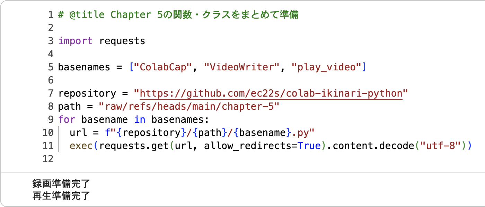

## 学習会用の独自関数・クラスを簡単に使う

<br>

　

- これまで、学習会用の独自関数・クラスを使う準備として、本リポジトリでコードをコピーし&thinsp;Colab&thinsp;の新規セルに貼り付け実行してきましたが、同じことを簡単に行う方法を紹介します

- 例えば&thinsp;Chapter 5&thinsp;の関数 `VideoWriter` を使う場合、以下を&thinsp;Colab&thinsp;で実行すれば準備完了

  ```
  import requests

  repository = "https://github.com/ec22s/colab-ikinari-python"
  url = f"{repository}/raw/refs/heads/main/chapter-5/VideoWriter.py"
  exec(requests.get(url, allow_redirects=True).content.decode("utf-8"))
  ```

- 関数の準備ができたかの確認は、以下のように `print(関数名)` を実行

  ```
  print(VideoWriter)
  ```

- 準備ができていれば出力欄に以下のように表示され、そうでなければエラーになる

  ```
  <function VideoWriter at ...
  ```

<br>

### Chapter 5の関数・クラスをまとめて準備

- 同じことを、関数・クラス毎に&thinsp;for&thinsp;ループで繰り返し（冒頭の画像）

  ```
  # @title Chapter 5の関数・クラスをまとめて準備

  import requests

  basenames = ["ColabCap", "VideoWriter", "play_video"]

  repository = "https://github.com/ec22s/colab-ikinari-python"
  path = "raw/refs/heads/main/chapter-5"
  for basename in basenames:
    url = f"{repository}/{path}/{basename}.py"
    exec(requests.get(url, allow_redirects=True).content.decode("utf-8"))
  ```

- 結果の確認

  ```
  # @title 確認：関数とクラスが準備できたか

  print(ColabCap)
  print(VideoWriter)
  print(play_video)
  ```

<br>

### 補足

- 最初からこの方法にしなかったのは、以下の学習のためです

  - GitHub&thinsp;でコードを見る

  - Colab&thinsp;での基本操作（セル作成・貼り付け・実行）

  - 独自関数・クラスの内容や動きの把握

- 本リポジトリに限らず、Web&thinsp;で公開されている&thinsp;Python&thinsp;スクリプトなら同じ方法で&thinsp;Colab&thinsp;に読み込み実行できます（URL&thinsp;を変更するだけ）

  - ただし内容・動作が不明なもの、作成者の素性が分からないものを実行するのは危険。悪意のあるスクリプトを実行してしまうと、最悪、Google&thinsp;アカウントを削除されたり損害賠償請求をされる可能性も😱

<br>

---
