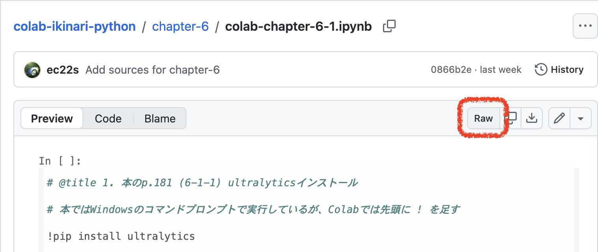
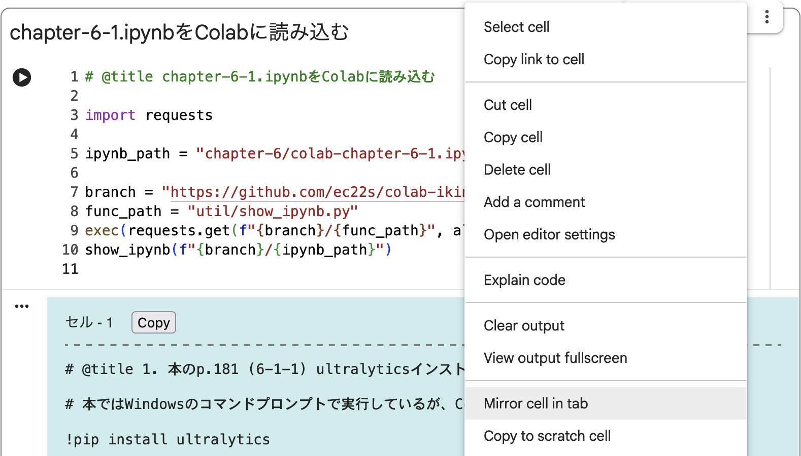

## 完成形のipynbファイルをColabに読み込む

<br>

　

### 趣旨

- 本リポジトリの&thinsp;Chapter&thinsp;別フォルダに、完成形の例として&thinsp;ipynb&thinsp;ファイル（Colab&thinsp;のノートブックの保存形式）を収録しています。例えば&thinsp;Chapter 6-1&thinsp;は&thinsp;[<ins>こちら。</ins>](../chapter-6/colab-chapter-6-1.ipynb)&thinsp;ただ、それらと&thinsp;Colab&thinsp;の画面を行ったり来たりするのは面倒で、PC&thinsp;の画面が小さいとエラーが出た時に見比べるのが難しいです。またセル毎のコピーボタンが&thinsp;GitHub&thinsp;になく不便です。

- そこで、Web&thinsp;上の任意の&thinsp;ipynb&thinsp;ファイルを&thinsp;Colab&thinsp;に読み込み表示する関数 [`show_ipynb.py`](./show_ipynb.py) を作りました。セル毎に背景色付きブロックとして表示します。

- 各セルの冒頭にコピーボタンがあり、押すとセルの中身がクリップボードにコピーされます（ブラウザによって動かない場合あり）

- 上の画像のように&thinsp;Colab&thinsp;でセルを左右に並べる機能を使えば、両方を見比べながら作業ができ便利です。

<br>

### ipynbファイルの読み込み

- まず&thinsp;ipynb&thinsp;ファイルの&thinsp;URL&thinsp;を確認します（本リポジトリのように&thinsp;GitHub&thinsp;で公開されている場合、右上にある&thinsp;Raw&thinsp;ボタン上で右クリックしリンク先をコピー）

  

- 次に、下記のコードをセルに入力し実行します（&thinsp;ipynb_path&thinsp;は上で控えた&thinsp;リンク先の後半、リポジトリトップからのパス）

  ```python
  # @title chapter-6-1.ipynbをColabに読み込む

  import requests

  ipynb_path = "chapter-6/colab-chapter-6-1.ipynb"

  branch = "https://github.com/ec22s/colab-ikinari-python/raw/refs/heads/main"
  func_path = "util/show_ipynb.py"
  exec(requests.get(f"{branch}/{func_path}", allow_redirects=True).content)
  show_ipynb(f"{branch}/{ipynb_path}")
  ```

<br>

### ipynbを右側に表示

- セルを実行し&thinsp;ipynb&thinsp;ファイルの中身が表示された状態で、右上のメニューで「タブのミラーセル」をクリック。セルが右側に複製されます（下図は英語メニューの場合）

  

- 左右を見比べながら作業できるよう、左側のセルを畳んで新しいセルを作り、右側のセルを適宜スクロールします

  

- 注意：左側で&thinsp;ipynb&thinsp;を読み込んだセルのコードや出力欄を消すと、複製した右側のセルも消える

<br>

### 補足

- Web&thinsp;上に公開されている&thinsp;ipynb&thinsp;で文字コードが `UTF-8` なら、関数 `show_ipynb` の引数に&thinsp;URL&thinsp;を渡すだけで基本、何でも読み込めます

- Colab&thinsp;と&thinsp;GitHub&thinsp;の連携を設定すると、GitHub&thinsp;上の&thinsp;ipynb&thinsp;を新しいノートブックとして読み込めます。が、今回のように作業中のノートブックに読み込む機能はありません（2026&thinsp;年&thinsp;6&thinsp;月現在）

<br>

---
